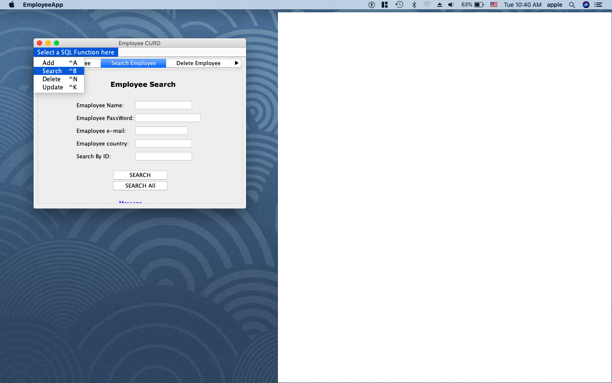
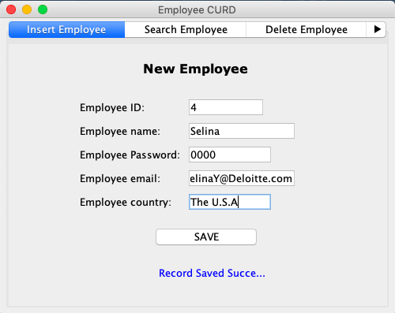
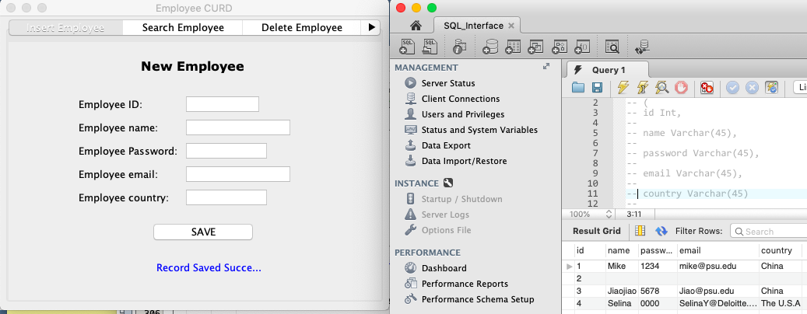
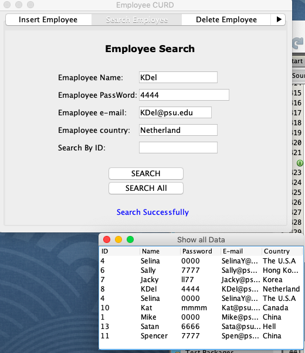
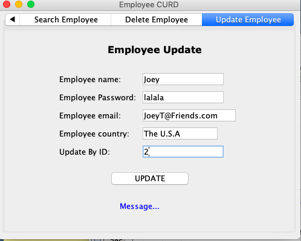
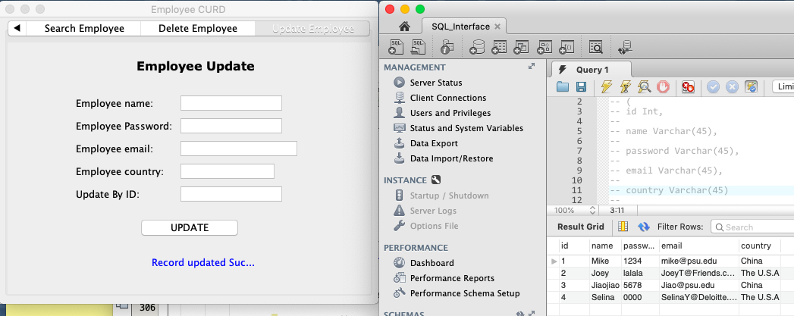
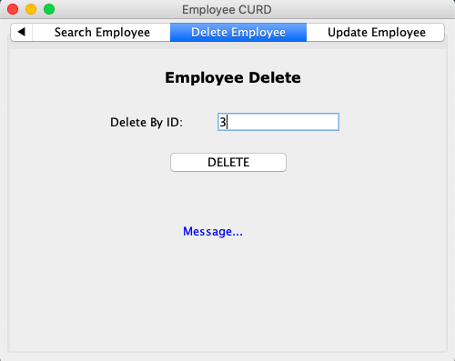
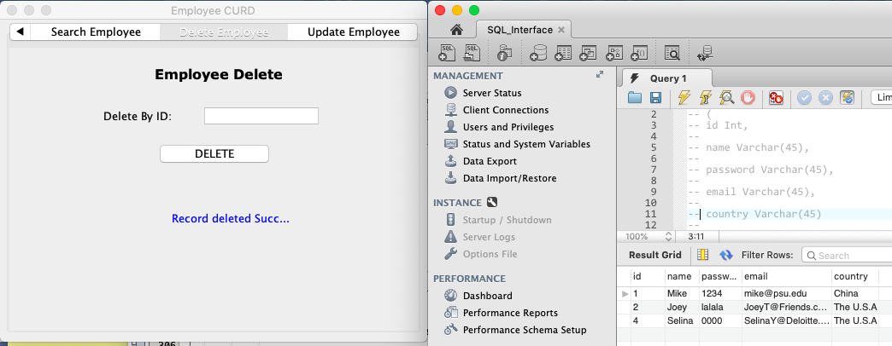

# Create a user interface with Java GUI to manipulate data entry job in MySQL with AWS

### user could entry the data

### user could search indiviual set of employee info but also all of them

### user can update details in mysql data

### user could delete data from mysql bd

